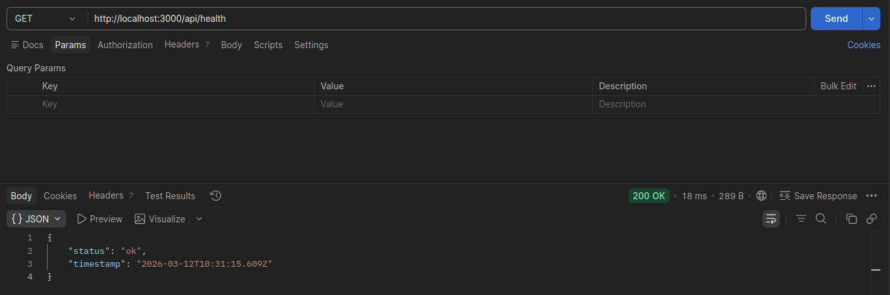
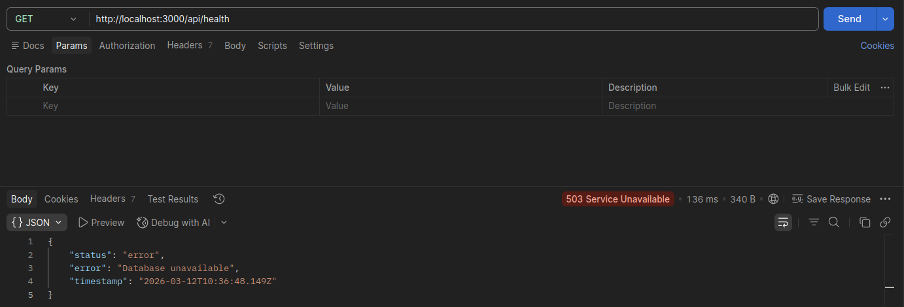
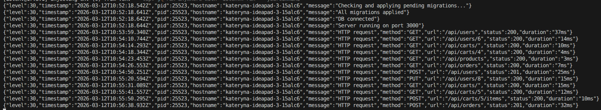
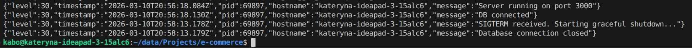

# ecommerce-app

REST API для простого застосунку магазину, побудований на Node.js + Express + PostgreSQL.

## Технології

- **Node.js** + **Express** — сервер та роутинг
- **PostgreSQL** — база даних
- **Sequelize** — ORM
- **Umzug** — міграції 
- **Jest** + **Supertest** — тестування
- **Pino** — логування

## Запуск локально

### 1. Клонувати репозиторій
```bash
git clone https://github.com/katerynabolotiuk/ecommerce-app.git
cd ecommerce-app
```

### 2. Встановити залежності

```bash
npm install
```

### 3. Створити `.env` файл

### 4. Запустити сервер

```bash
npm start
```

## Змінні оточення

| Змінна | Опис | Приклад |
|--------|------|---------|
| `DB_USER` | користувач PostgreSQL | `myuser` |
| `DB_PASSWORD` | пароль PostgreSQL | `mypassword` |
| `DB_NAME` | назва БД для розробки | `ecommerce_dev` |
| `DB_NAME_TEST` | назва БД для тестів | `ecommerce_test` |
| `DB_HOST` | хост БД | `localhost` |
| `DB_PORT` | порт БД | `5432` |
| `PORT` | порт сервера | `3000` |
| `DB_NAME_PROD` | назва БД для production | `ecommerce_prod` |
| `DB_HOST_PROD` | хост БД для production | `prod-host` |

## Тести

```bash
# запуск всіх тестів
npm test

# тільки unit тести
npm run test:unit

# тільки інтеграційні тести
npm run test:integration
```
## Health Check

Ендпоінт `GET /health` повертає стан підключення до бази даних.

**200 — БД підключена:**


**503 — БД недоступна:**


## Приклад логів



## Graceful Shutdown

Для зупинки сервера з graceful shutdown:

```bash
kill -SIGTERM <pid>
```



## API ендпоінти

### Users
| Метод | Ендпоінт | Опис |
|-------|----------|------|
| POST | `/api/users` | створити користувача |
| GET | `/api/users` | отримати всіх користувачів |
| GET | `/api/users/:id` | отримати користувача за id |
| PUT | `/api/users/:id` | оновити користувача |
| DELETE | `/api/users/:id` | видалити користувача |

### Products
| Метод | Ендпоінт | Опис |
|-------|----------|------|
| POST | `/api/products` | створити продукт |
| GET | `/api/products` | отримати всі продукти |
| GET | `/api/products/:id` | отримати продукт за id |
| PUT | `/api/products/:id` | оновити продукт |
| DELETE | `/api/products/:id` | видалити продукт |

### Carts
| Метод | Ендпоінт | Опис |
|-------|----------|------|
| POST | `/api/carts` | створити кошик |
| GET | `/api/carts` | отримати всі кошики |
| GET | `/api/carts/:id` | отримати кошик за id |
| POST | `/api/carts/:id/items` | додати товар до кошика |
| PUT | `/api/carts/:cartId/items/:itemId` | оновити кількість товару |
| DELETE | `/api/carts/:id` | видалити кошик |

### Orders
| Метод | Ендпоінт | Опис |
|-------|----------|------|
| POST | `/api/orders` | створити замовлення |
| GET | `/api/orders` | отримати всі замовлення |
| GET | `/api/orders/:id` | отримати замовлення за id |
| PATCH | `/api/orders/:id/status` | оновити статус замовлення |
| DELETE | `/api/orders/:id` | видалити замовлення |
